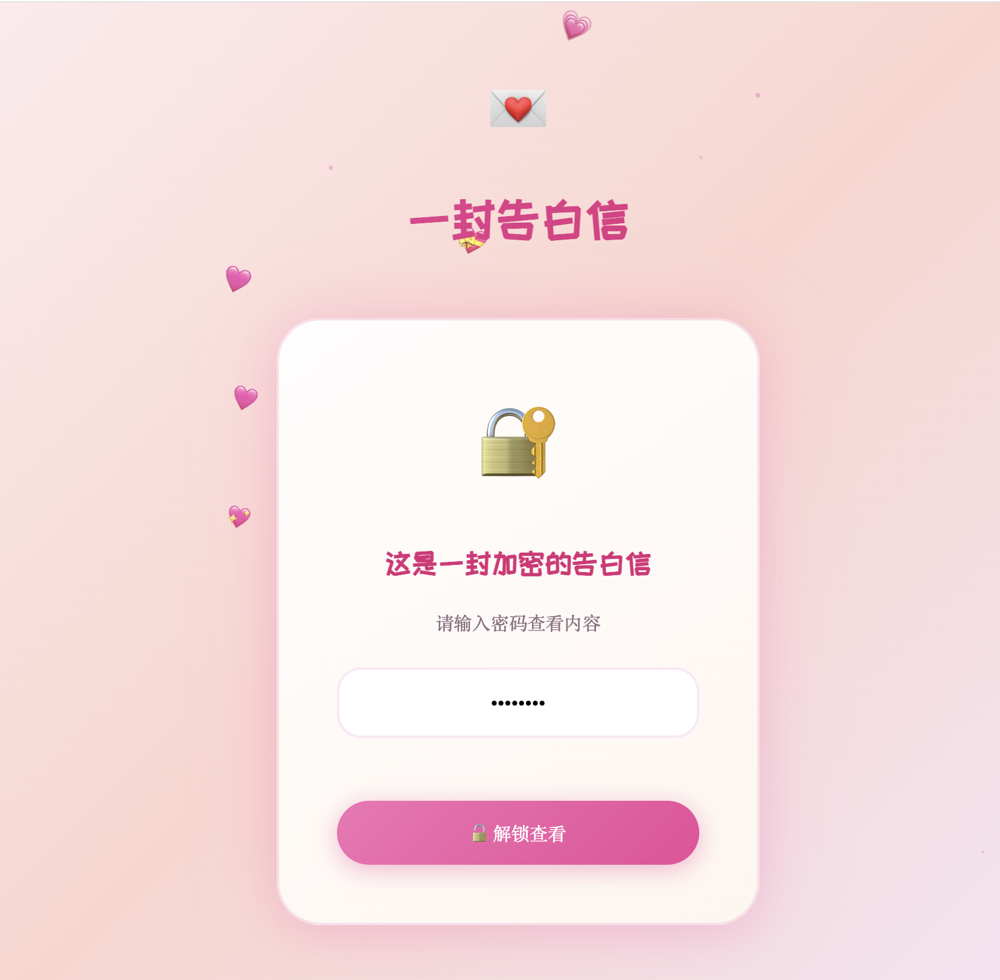
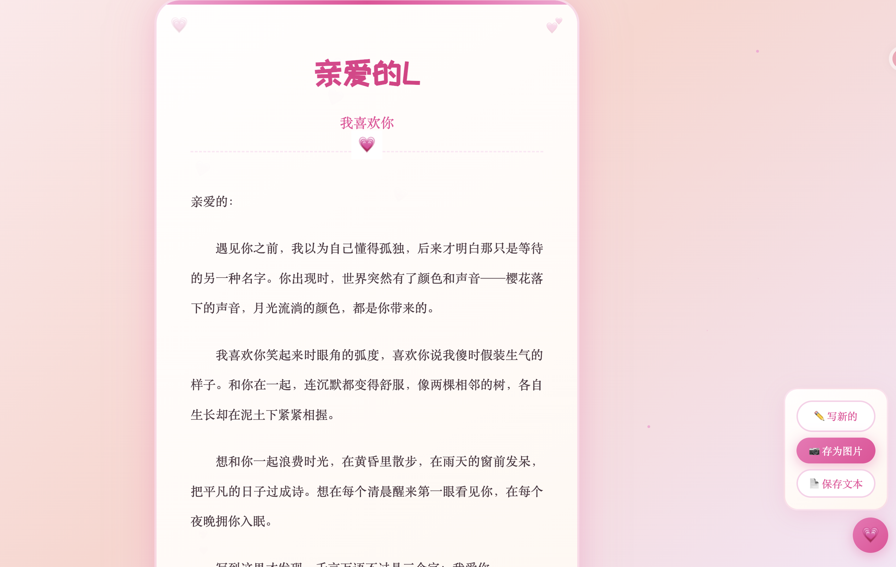

# 告白信网站 💌

一个轻量优雅的在线告白信创建与分享平台，支持密码保护功能。

## 特性

- 🎨 **精美设计** - 使用玫瑰金配色的浪漫视觉风格
- 🔒 **密码保护** - 可为告白信设置访问密码
- 📱 **响应式布局** - 完美适配移动端和桌面端
- ✨ **动画效果** - 流畅的过渡动画和视觉特效
- 💾 **持久化存储** - 数据本地 JSON 文件存储

## 项目截图

### 入口页面


### 编辑器


### 查看页面



## 技术栈

- **前端**: HTML5, CSS3 (OKLCH 色彩空间), Google Fonts
- **后端**: Node.js, Express.js
- **存储**: 文件系统 (JSON)

## 页面说明

| 页面 | 路径 | 说明 |
|------|------|------|
| 首页 | `/` | 展示精美告白信模板 |
| 编辑器 | `/editor.html` | 创建新的告白信 |
| 查看页 | `/view.html` | 查看告白信 (支持密码验证) |
| 生成器 | `/generator.html` | 批量生成工具 |
| 自动生成器 | `/auto-generator.html` | 自动化生成工具 |

## 快速开始

### 安装依赖

```bash
npm install
```

### 启动服务器

```bash
npm start
```

访问 http://localhost:3000

## API 接口

### 创建告白信
```bash
POST /api/letter
Content-Type: application/json

{
  "title": "亲爱的",
  "subtitle": "我喜欢你",
  "content": "想说的话...",
  "signature": "爱你的",
  "signatureName": "小明",
  "password": "5201314"
}
```

### 获取告白信
```bash
GET /api/letter/:id
```

### 验证密码
```bash
POST /api/letter/:id/verify
Content-Type: application/json

{
  "password": "5201314"
}
```

## 项目结构

```
love_site/
├── index.html              # 首页
├── editor.html             # 编辑器页面
├── view.html               # 查看页面
├── generator.html          # 生成器
├── auto-generator.html     # 自动生成器
├── server.js               # Express 服务器
├── package.json            # 项目配置
├── DEPLOYMENT.md           # 部署指南
├── data/
│   └── letters/            # 告白信数据存储
├── routes/
│   └── letters.js          # 路由模块
└── public/                 # 静态资源
```

## 部署

详细的部署指南请参考 [DEPLOYMENT.md](./DEPLOYMENT.md)

### 快速部署 (PM2)

**启动服务**
```bash
npm install -g pm2
pm2 start server.js --name love-letter
pm2 save
pm2 startup
```

**停止服务**
```bash
# 停止单个服务
pm2 stop love-letter

# 停止所有服务
pm2 stop all

# 停止并删除服务（从 PM2 列表中移除）
pm2 delete love-letter

# 删除所有服务
pm2 delete all
```

**常用命令**
```bash
pm2 list              # 查看所有服务状态
pm2 logs love-letter  # 查看日志
pm2 restart love-letter  # 重启服务
```

### Docker 部署

```bash
docker build -t love-letter .
docker run -p 3000:3000 -d love-letter
```

## 安全建议

1. 生产环境务必使用 HTTPS
2. 建议添加密码强度验证
3. 可添加 API 限流防止暴力破解
4. 定期备份 `data/letters/` 目录数据

## License

ISC
